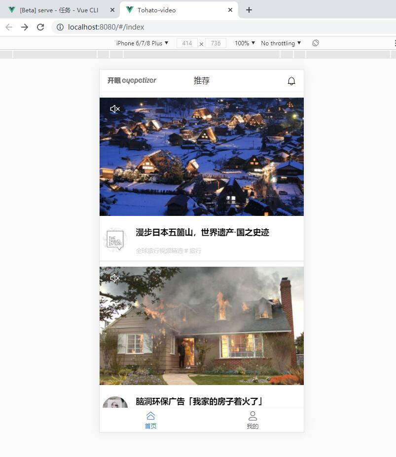
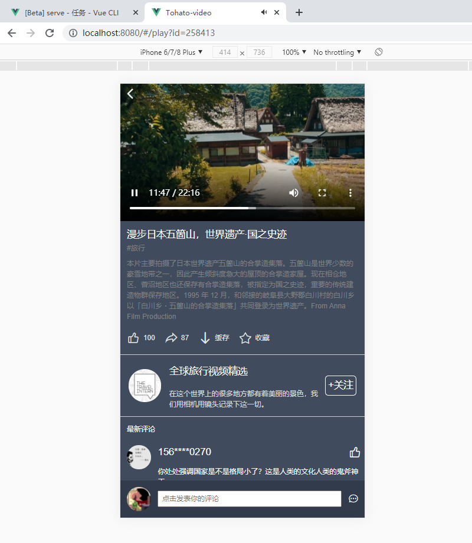
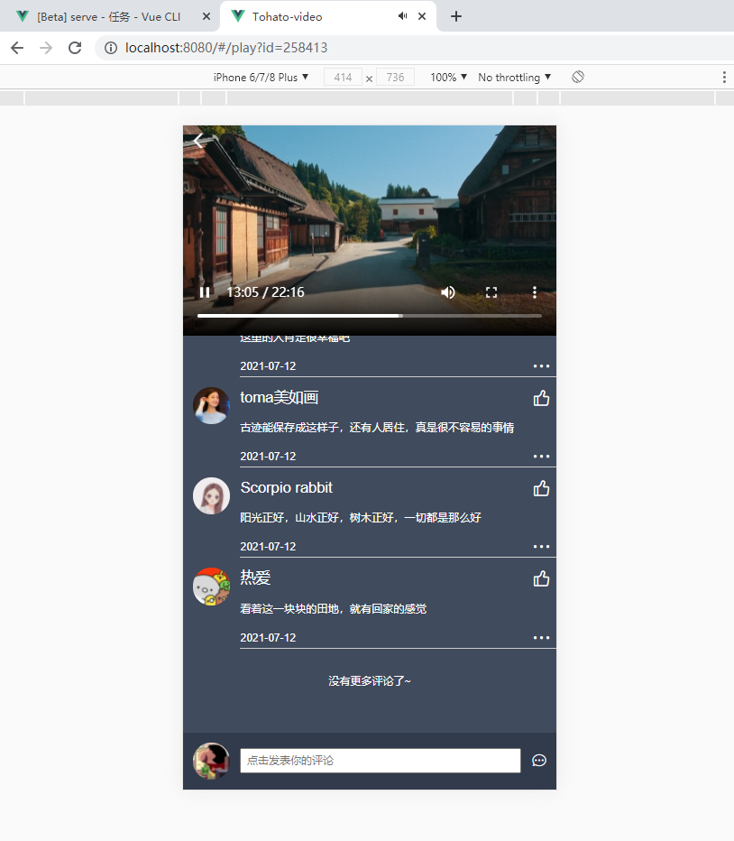
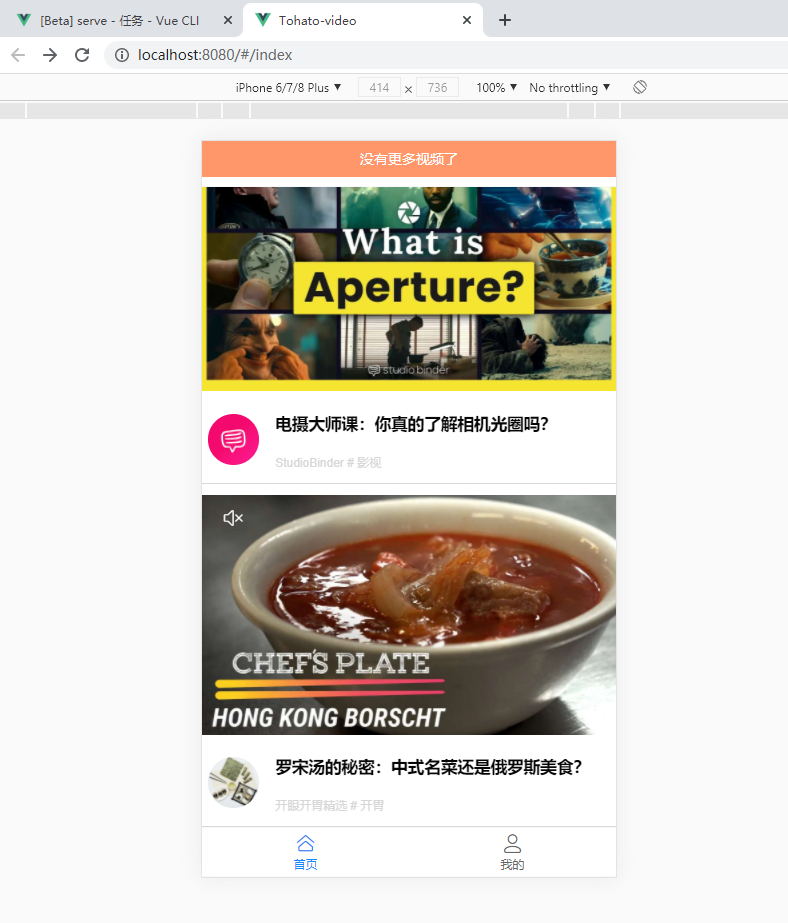
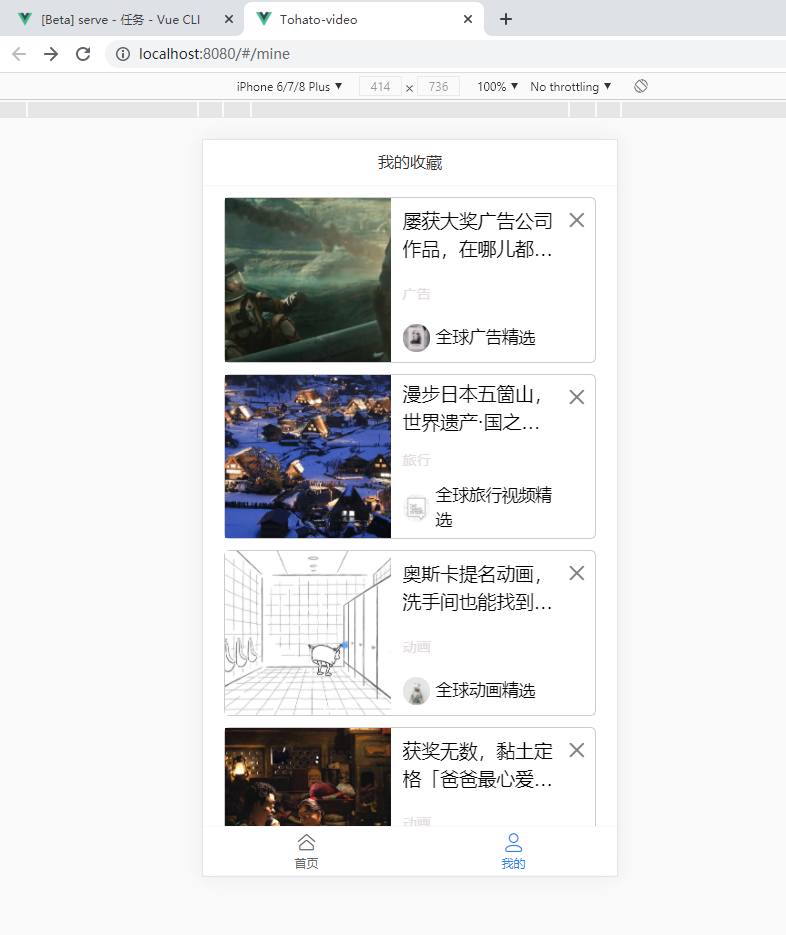
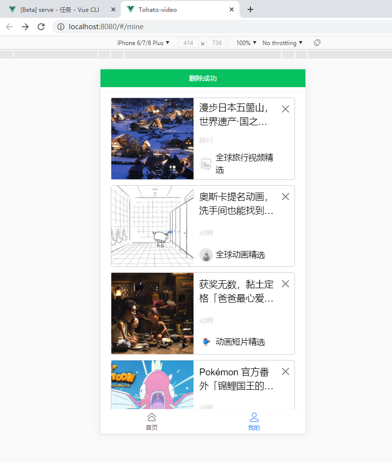

# Tohato-video

模仿开眼app的ui界面，采用750px设计尺寸并且采取`flexible.js`+`rem`的方式进行自适应布局

后端接口：https://baobab.kaiyanapp.com

## 项目截图

### 首页



### 详情页





### 上拉加载



### 收藏页





## 技术栈

- Vue CLI (Vue脚手架工具)
- Vue (核心框架)
- Vue Router (页面路由)
- Vuex (状态管理)
- Vant-ui (移动端Vue组件库)
- Less (CSS预处理器)
- Axios (网络请求)
- Normalize.css (初始化移动端样式)
- vuex-persistedstate (默认持久化Vuex数据的插件)

## 功能

- 上拉加载
- 播放视频
- 查看评论
- 收藏视频
- 删除已收藏视频

## 安装与使用

```sh
# 下载 Tohato-video
git clone https://gitee.com/liar1997/Tohato-video.git

# 进入 Tohato-video 项目目录
cd Tohato-video

# 安装依赖
npm install

# 本地运行
npm run serve

# 编译打包
npm run build
```

